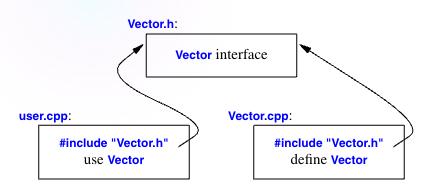

---
hide:
    - toc 
    - navigation
title: Modularity 
---

!!! tip "Reading TextBook"
    [Chapter 3 Modularity](PDF/chapter_3.pdf)


!!! info  "For further reading, see:"
    - [🔴 C++ Primer Chapter 6: Functions](#)  
    (Separate compilation, declarations vs definitions, namespace)
    - [🔴 C++ Primer Chapter 7: Classes](#)  
    (Class interfaces, constructors, invariants)
    - [🔴 C++ Primer Chapter 16: Templates & static_assert](#)
    - [🔴 C++ Primer Chapter 17: namespace](#)  
    - [🔴 C++ Primer Chapter 18: Exception Handling](#)  
    
!!! info "Key Advice"
    === "Advice 1"
        **Distinguish between declarations (use as interfaces) and definitions (used as implementations)** 分离编程，模块化处理的基石
        
        

        === "Vector.h" 
            **Use header files to represent interfaces and to emphasize logical structure**  

            **Avoid non-inline function definitions in headers;**

            ```cpp
            class Vector {
                public:
                    Vector(int s);
                    double& operator[](int i);
                    int size();
                private:
                    double* elem;
                    int sz;
            }
            ```
        === "Vector.cpp"
            **`#include` a header in the source file that implements its functions;**
            ```cpp
            #include "Vector.h" // 需要引入头文件(声明)

            Vector::Vector(int s):elem{new double[s]}, sz{s} {} // 构造函数

            double& Vector::operator[](int i) {return elem[i];} 

            int Vector::size() {return sz;} 
            ```
        === "user.cpp"
            用户只需要引入头文件就可以享用所有接口，而不需要关注其底层是如何实现的（抽象层）
            ```cpp
            #include "Vector.h" 
            #include <math.h>

            using namespace std;

            double sqrt_sum(Vector& v) {
                double sum = 0;
                for (int i = 0; i!= v.size(); ++i)
                    sum += sqrt(v[i]);
                return sum; 
            }
            // .... 
            ```
    === "Advice 2"
        **Use namespace to express logical structure** 

    === "Advice 3" 
        **Develop an error-handling strategy early in a design** C++的异常处理依赖于程序员并且不强制要求进行错误处理。
        === "throw"        
            `throw` transfers control to a handler for exceptions. 抛出异常而本身不处理异常。

            ```cpp
            double& Vector::operator[](int i) {
                if (i < 0 || size() <= i)
                    throw out_of_range{"Vector::operator[]"}; // 仅仅抛出异常，一直沿着函数调用栈来检索能够接受并处理异常的部分，若没有则会导致程序崩溃
                return elem[i];
            }
            ``` 

        === "try-catch"

            ```cpp
            void f(Vector& v) {
                try { // exceptions here are handled by the handler defined below
                    v[v.size()] = 7; // try to access beyond the end of v
                }
                catch (out_of_range) { // oops: out_of_range error
                    // ...handle range error...
                }
            }
            ```
        === "noexcept"
            如果你确定某段代码(主要指函数)在执行过程中一定不会发生异常{++⚠️是程序员假设其本不应该发生错误++}，可以加上`noexcept`关键字，若其产生了任何异常，会调用标准库中的`terminate()`直接终止当前程序。 

            ```cpp
            void user(int sz) noexcept {
                Vector v(sz);
                iota(&v[0],&v[sz], 1); // fill v with 1,2,3,4...
            }
            ```

        === "Invariants"
            不变量是一个很重要的概念，其深入讨论大多集中在进阶书籍中，例如：

            - [🔴 Effective C++ Item 26 Postpone variable definitions as long as possible](#)
            - [🔴 Effective C++ Item 29 Strive for exception-safe code](#)
            - [🔴 Effective C++ Item 41 Understand implicit interfaces and compile-time polymorphism](#)
            - [🔴 Design by Contract](#)

            对于当前阶段，仅需要掌握以下核心理解：

            - 为一个类/对象设定的、任何时候都必须成立的条件。
            - 构造函数必须负责建立不变量；
            - 成员函数在运行结束后，应保证对象的不变量仍然成立。

        === "static assertions"
            上述内容都是对于`run time`（运行时）异常的处理，有些错误其实是可以在编译期就被检测出来，越早发现处理起来的消耗就越小。所以 C++提供了一种在编译器进行断言的办法`static_assert`. (static_assert mechanism can be used for anything that can be expressed in terms of constant expressions)

            ```cpp
            constexpr double c = 299792.458;

            void f(double speed) {
                const double local_max = 160.0 / (60 * 60);
                static_assert(speed < C, "can't go that fast");  // error, speen must be a constant
                static_assert(local_max < C, "can't go that fast"); // ok
            }
            ```

            static_assert用处最大的地方在于泛型编程中用于对作为参数的类型进行检查的时候。


