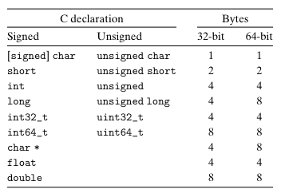

---
hide:
    - toc
    - navigation
title: 2.1 Information Storage
---

!!! note "Readign Textbook"
    [Chapter 2.1 Information Storage](./csapp-chapter-2-1.pdf)

## Note

`32位64位`软件并不是取决于其运行的计算机类型,而是取决于其的 `编译方式`. 

C语言32位和64的基本数据类型的`典型`大小,如下图.

{.img-invert}

## Practice Problem 
!!! info "Conversion Exercises"
    Perform the following number conversions:

    A. 0x25B9D2 to binary  
    B. binary 1010111001001001 to hexadecimal  
    C. 0xA8B3D to binary  
    D. binary 11001000101101100101110 to hexadecimal

    ??? tip "Solution"
        
        - 0010 0101 1011 1001 1101 0010
        - 0xAE49
        - 1010 1000 1011 0011 1101
        - 0x322D96

!!! info "Conversion Exercises"
    Fill in the blank entries in the following table, giving the decimal and hexadecimal representations of different powers of 2:

    

    | n | 2n (decimal) | 2n (hexadecimal) |
    |---|---|---|
    | 5 | 32 | 0x20 |
    | 23 |   |   |
    |   | 32,768 | 0x2000 |
    | 12 |   |   |
    |   | 64 | 0x100 |

    

    ??? tip "Solution"
        

        | n | 2n (decimal) | 2n (hexadecimal) |
        |---|---|---|
        | 5 | 32 | 0x20 |
        | 23 | 8,388,608 | 0x800000 |
        | 15 | 32,768 | 0x8000 |
        | 12 | 4,096 | 0x1000 |
        | 6 | 64 | 0x40 |

        

!!! info "Conversion Exercises"
    A single byte can be represented by 2 hexadecimal digits. Fill in the missing entries in the following table, giving the decimal, binary, and hexadecimal values of different byte patterns:

    

    | Decimal | Binary | Hexadecimal |
    |---|---|---|
    | 0 | 0000 0000 | 0x00 |
    | 158 | | |
    | 76 | | |
    | 145 | | |
    | | 1010 1110 | |
    | | 0011 1100 | |
    | | 1111 0001 | |

    

    ??? tip "Solution"
        

        | Decimal | Binary | Hexadecimal |
        |---|---|---|
        | 0 | 0000 0000 | 0x00 |
        | 158 | 1001 1110 | 0x9E |
        | 76 | 0100 1100 | 0x4C |
        | 145 | 1001 0001 | 0x91 |
        | 174 | 1010 1110 | 0xAE |
        | 60 | 0011 1100 | 0x3C |
        | 241 | 1111 0001 | 0xF1 |

        

## HomeWork 