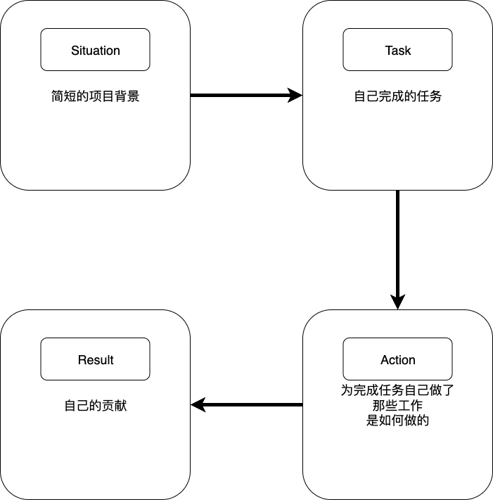

# 面试的流程

{++神马都是浮云,应聘技术岗就是要踏实些程序++}

## 面试小技巧

- 对于英语面试,敢于说"Pardon",不要不懂装懂. 
- 测试在前,开发在后.
    - 不要一听到问题就开始写代码,尽可能思考全面测试后再开始写
- {++STAR模型描述项目++}
    - 重点介绍 {++task:自己完成的任务++}



- 谨慎使用{++了解,熟悉,精通++}
  - 了解: 对于某些技术仅上过课或者看过书,而没有做过具体的项目.
      - 一般了说{++了解++}的技术不用写在简历上,除非是应聘岗位的硬性要求
  - 熟悉: 在实际项目中使用某些技术很久,通过查阅相关文档可以解决大部分问题
      - 简介的重点内容
  - 精通: 能够轻松回答这个领域内的绝大多数问题
      - 一般不要轻易在简历上使用精通

## 注重代码质量
对于代码题不仅仅要求在普通输入的情况下能够通过,还要尽可能考虑边界条件与极端条件. 

例如对于如下问题 
!!! question 
    1. 把一个字符串转换成整数
    2. 求链表中的倒数第k个结点

比较容易的答案有
```cpp
// Question 1
int StrToInt(char *string) {
    int number = 0;
    while(*string != 0) {
        number = number * 10 + *string - '0';
        ++string;
    }

    return number;
}

// Question 2
ListNode *FindKthToTail(ListNode *pListHead, unsigned int k) {
    if (pListHead == nullptr) return nullptr;

    ListNode *pAhead = pListHead;
    ListNode *pBehind = nullptr;

    for(unsigned int i = 0; i < k - 1; ++i) pAhead = pAhead->m_pNext;

    pBehind = pListHead;

    while(pAhead->m_pNext != nullptr) {
        pAhead = pAhead->m_pNext;
        pBehind = pBehind->m_pNext;
    }

    return pBehind;
}
```

但仔细想想上面代码有如下问题 

对于 `Question 1 Solution` 

- 没有考虑各种特殊输入
    - 字符串中有非数字字符和正负号
    - 没有考虑可能的整数溢出
    - 字符串不能转换的情况如何处理?
    - 没有做空指针判定

对于 `Question 2 Solution`

- 对于`k`的讨论不够充分
